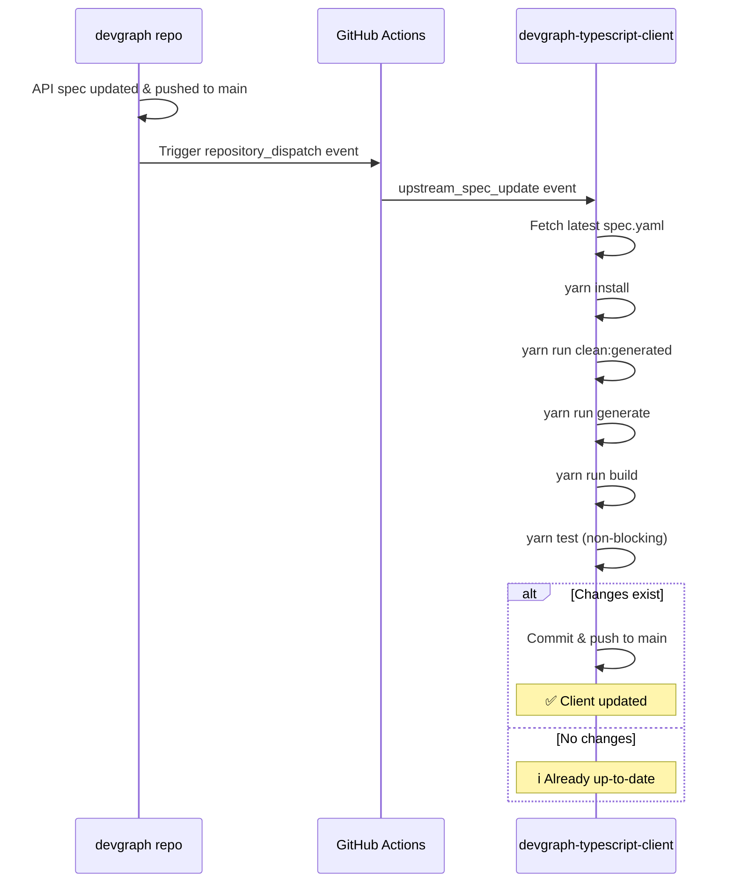

# devgraph-typescript-client Workflows

This repository contains GitHub Actions workflows for automatically regenerating the TypeScript client when the upstream Devgraph API specification changes.

## Workflows

### `upstream-sync-auto-commit.yml` - Auto-commit to Main
**Trigger**: Dispatched from `arctir/devgraph` on spec updates

Automatically regenerates and commits TypeScript client code directly to the `main` branch when the upstream API spec changes.

**How it works:**
1. Fetches latest API spec from `devgraph/specs/devgraph/v1/spec.yaml`
2. Runs `yarn install` to ensure dependencies are up-to-date
3. Runs `yarn run clean:generated` to remove old generated code
4. Runs `yarn run generate` to regenerate TypeScript client with `@hey-api/openapi-ts`
5. Runs `yarn run build` to compile TypeScript
6. Runs `yarn test` (non-blocking - warnings only)
7. If changes exist, commits directly to main

**Benefits:**
- ✅ Fully automated - no manual intervention
- ✅ TypeScript client stays in sync with API changes
- ✅ Built and validated before committing
- ✅ Changes available immediately

**Note:** Tests are non-blocking to allow the workflow to proceed even if tests fail. Failed tests generate warnings in the workflow output.

## Setup

### Repository Permissions

Ensure the repository has write permissions for GitHub Actions:

1. Go to **Settings → Actions → General**
2. Under "Workflow permissions", select **"Read and write permissions"**
3. Save changes

This allows the workflow to commit changes back to the repository.

### NPM Authentication

If you need to publish the package automatically, add the `NODE_AUTH_TOKEN` secret:

1. Go to **Settings → Secrets and variables → Actions**
2. Add a new secret named `NODE_AUTH_TOKEN`
3. Use your GitHub Personal Access Token with `write:packages` scope

## How It Works



## Manual Trigger

You can manually trigger the workflow from the Actions tab:

1. Go to **Actions** → **Sync from Upstream Spec (Auto-commit)**
2. Click **"Run workflow"**
3. Select the branch (usually `main`)
4. Click **"Run workflow"**

This is useful for:
- Testing the workflow
- Forcing a regeneration after fixing issues
- Syncing after missed dispatch events

## Local Development

To regenerate the TypeScript client locally:

```bash
# Make sure you have the latest spec from devgraph repo
cd ../devgraph
git pull origin main

# Return to devgraph-typescript-client and regenerate
cd ../devgraph-typescript-client
yarn install
yarn run clean:generated
yarn run generate
yarn run build
yarn test
```

## Configuration

### openapi-ts.config.ts
Configuration for the `@hey-api/openapi-ts` client generator:
- **Input**: `../devgraph/specs/devgraph/v1/spec.yaml`
- **Output**: `src/`
- **Format**: Uses Prettier for code formatting
- **Plugins**: Uses `@hey-api/client-next` plugin

Example configuration:
```typescript
import { defineConfig } from '@hey-api/openapi-ts';

export default defineConfig({
  input: '../devgraph/specs/devgraph/v1/spec.yaml',
  output: {
    format: "prettier",
    path: 'src/',
  },
  plugins: ['@hey-api/client-next'],
});
```

### package.json scripts
Key scripts used by the workflow:
- `yarn run generate`: Generate TypeScript client from OpenAPI spec
- `yarn run clean:generated`: Remove old generated code
- `yarn run build`: Compile TypeScript to JavaScript
- `yarn test`: Run test suite

## Troubleshooting

### Workflow not triggering

**Possible causes:**
1. The upstream devgraph repo isn't sending the dispatch event
2. The `DOWNSTREAM_DISPATCH_TOKEN` secret isn't set in the devgraph repo
3. The workflow file isn't in the default branch

**Solution:**
- Check the devgraph repo's Actions logs to see if dispatches were sent
- Verify the token has access to this repository
- Ensure the workflow file is committed to `main`

### Build failing

If the build fails, the commit is blocked.

**To fix:**
1. Check the Actions log to see the build error
2. Fix the issue locally:
   ```bash
   yarn run generate
   yarn run build
   ```
3. Push your fix
4. Re-run the workflow manually

### Generated code issues

If the generated code has TypeScript errors:

**Possible causes:**
1. The OpenAPI spec has validation errors
2. The `@hey-api/openapi-ts` version needs updating
3. TypeScript version incompatibility

**Solution:**
```bash
# Update dependencies
yarn upgrade @hey-api/openapi-ts

# Regenerate
yarn run clean:generated
yarn run generate

# Build
yarn run build
```

### Tests failing (non-blocking)

The workflow allows tests to fail but logs a warning. To fix test failures:

```bash
# Run tests locally
yarn test

# Fix failing tests
# ...

# Push changes
git add .
git commit -m "fix: resolve test failures"
git push
```

### Permission denied when pushing

If you see "Permission denied" errors:

1. Go to **Settings → Actions → General**
2. Under "Workflow permissions", select **"Read and write permissions"**
3. Re-run the workflow

## Commit Message Format

Automated commits use the following format:

```
chore: regenerate TypeScript client from upstream spec update

Automated commit triggered by upstream spec update from devgraph repository.

Source commit: abc123...
Triggered by: GitHub Actions upstream-sync workflow
```

This format:
- Starts with `chore:` (follows conventional commits)
- Includes context about what triggered the change
- References the upstream commit for traceability

## Publishing

This workflow does NOT automatically publish to npm. Publishing is handled by a separate workflow.

To publish manually:
```bash
# Update version in package.json
npm version patch  # or minor, major

# Build
yarn run build

# Publish
npm publish
```

See the `publish.yml` workflow for automated publishing on version tags.

## Questions?

See the main devgraph repository's [GitHub Actions documentation](https://github.com/arctir/devgraph/blob/main/.github/workflows/README.md) for more details on the overall automation strategy.
